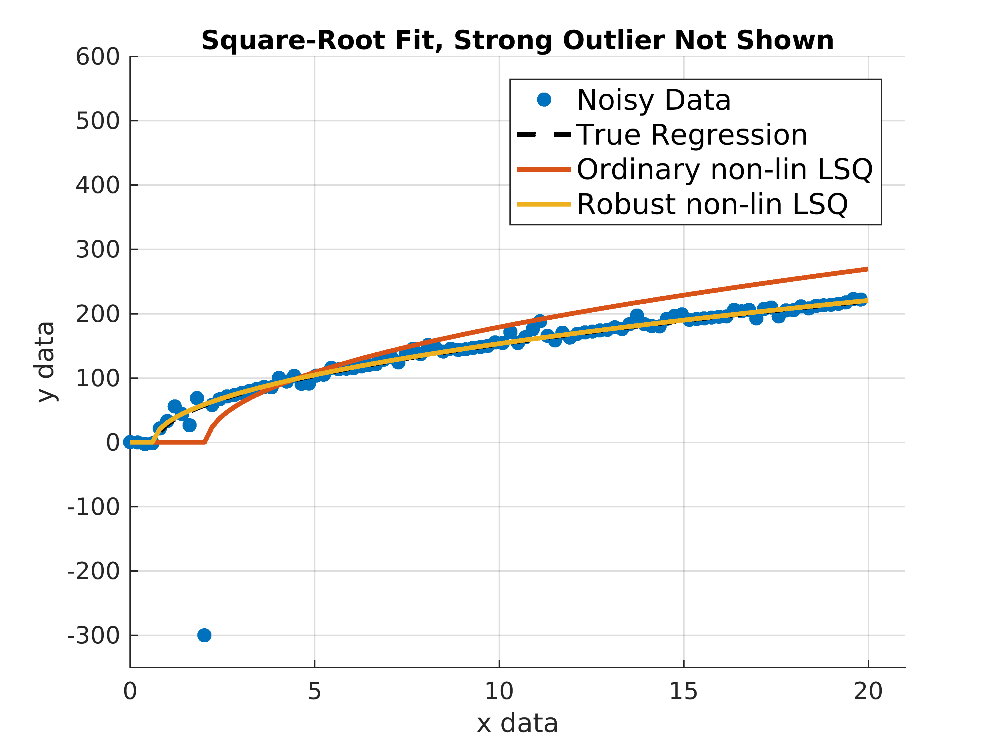

# MatlabRobustNonlinLsq

MATLAB's function `robustfit()` enables to fit a polynomial to data whose residuals are not normally distributed, which is the implicit assumption of least squares (LSQ) methods. Non-normal residuals result, for example, from outliers in empirical data or noise which is not normally distributed. The function utilizes the *Iteratively Reweighted Least Squares* (IRLS) approach with data-adaptive weights.

The downside is that `robustfit()` does not support *non-linear least squares* problems which often arise if the mathematical model is non-linear in its parameters. The function `lsqcurvefit()` and `lsqnonlin()` provide means to solve non-linear LSQ with optional parameter bounds (due to the *trust-region-reflective* algorithm) but don't support weighted LSQ for robust estimation in the presence of outliers.

This MATLAB function is intended to give the best of both worlds, i.e. combine methods of `robustfit()` and `lsqnonlin()` to accomplish robust non-linear least squares calculations.

## Dependencies

This function is tested in MATLAB R2016b but should scale to any modern MATLAB release.

The function depends on the following toolboxes:
- Statistics and Machine Learning Toolbox
- Optimization Toolbox

## Usage

Consider the following problem. We want to fit a function to data which stems from a square-root function with a scale and location parameter. The data is noisy and exhibits strong outliers. Let's see how ordinary and robust non-linear least squares perform in this situation. The example is taken from the provided demo file.

```matlab
% the model's true parameters
trueParams = [50, -0.7];

% create some noisy data using a square root function with 2 parameters and nasty noise
x = linspace(0, 20, 100);
modelFun = @(param, x) param(1)*sqrt(max(0, x + param(2)));

noise = 10*sin(x).^2 .* randn(size(x));

y = modelFun(trueParams, x) + noise;

% introduce outliers
y(11)  = -300;
y(end) = 2000;

%%%% Fit the model %%%%
% make sure the parameters are within the following range
lb = [1, -inf];
ub = [inf, 10];

% initial guess
x0 = [1, -1];

% don't show infos from lsqcurvefit()
options = optimset(@lsqcurvefit);
options.Display = 'off';

% estimate parameters using ordinary and robust LSQ
estParamsOrdinary = lsqcurvefit(modelFun, x0, x, y, lb, ub, options);
estParamsRobust   = robustlsqcurvefit(modelFun, x0, x, y, lb, ub, [], options);

figure;
hold on;
scatter(x, y, 'filled');
plot(x, modelFun(trueParams, x), 'k--', 'linewidth', 2);
plot(x, modelFun(estParamsOrdinary, x), 'linewidth', 2');
plot(x, modelFun(estParamsRobust, x), 'linewidth', 2);
hold off;
grid on;

legend(...
    {'Noisy Data', 'True Regression', 'Ordinary non-lin LSQ', 'Robust non-lin LSQ'}, ...
    'fontsize', 12 ...
    );
```



## License

The code is licensed under BSD 3-Clause license.
